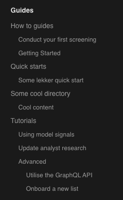

# Leveraging auto-generated documentation

The Alis Build platform provides out-of-the-box documentation for products built on the platform. This documentation consists of API reference documentation auto-generated directly from the protocol buffers, custom user guides and code samples which teams may compile to provide greater assistance to clients.

In this guide, we aim to give you the necessary background to leverage this documentation service.

::: tip **Before you start**
1. Download and install the [Alis CLI](/guides/getting-started/command-line-interface);
2. Ensure you are part of an existing organisation and product on the platform;
3. Have pulled the latest version of your organisation's protos by running `alis org get {yourOrg}`.
:::

## Overview

The product documentation is generated by parsing the following files in the relevant product directory of your organisation's `proto` repo:
1. The `resources` and `services` proto files which are used to generate the reference documentation based on the contents of each proto file as per their latest release (`alis proto release`).
2. The custom Markdown files contained within the `docs` folder, used to generate the landing page, guides and samples.
```
proto
├──{orgID}
│   └── {productID}
│       ├── docs/.../*.md
│       ├── resources/.../*.proto
│       └── services/.../*.proto
```

Once the documentation has been released, it will be publicly available at [https://docs.{productID}.{orgDomain}](https://docs.de.alis.services) (e.g. [https://docs.de.alis.services](https://docs.de.alis.services)).

## Updating reference documentation

The reference documentation component is generated from the proto files. The emphasis on the definition first-approach ensures that the effort is focussed on the design of the protos with detailed comments above the various services, methods, messages and fields and this design is then propagated into the reference documentation for the APIs.

::: warning
It is important to note that this auto-generated documentation is publicly available. Any protocol buffer content that should not be publicly available should be specified as `hidden`.
The [specifying proto visibility scopes guide](/guides/how-to-guides/proto-visibility-scopes) explains how to implement visibility scopes.
:::

::: danger **Caveats**
A current caveat is that the use of certain Markdown syntax in your comments may result in invalid Markdown syntax in the generated documentation, causing the build of your documentation to fail. This is primarily the usage of the “|” character in your proto comments as well as using line breaks in links.
:::

## Writing guides and samples

The initial state (after a product creation) of the `docs` directory should resemble the folder structure depicted below, i.e. must then have an `index.md` file at the root of `docs` as well as `guides`, `reference` and `samples` subdirectories each containing an `index.md` directory.

```
docs
├── index.md
├── guides
│   └──index.md
├── reference
│   └── index.md
└── samples
│   └── index.md
└── index.md
```

The `index.md` file at the root directory, serves as the landing page for the documentation site and can be customised using the [VitePress Home Page theme](https://vitepress.vuejs.org/guide/theme-home-page#home-page).
Alternatively, a redirect to another existing page can be specified by using the [redirect functionality](#redirect-to-a-different-page).

The other `index.md` files is the respective page that will be opened when the `guides`, `reference` and `samples` navigation tab is opened on the site.

:::warning
The `index.md` is REQUIRED for all three of the `guides`, `reference` and `samples` directories.
:::

Any subdirectory added under `guides` and `samples` will be converted into a heading in the documentation navigation sidebar, it's depth being determined by the file structure. Markdown files can then be placed inside either the root or any of the subdirectories of `guides` and `samples` and will be added to the documentation sidebar. An example file structure and the resulting documentation navigation sidebar for the `guides` section is depicted below.
By default, the navigation bar structures directories in alphabetical order, see the [customization section](#custom-ordering-in-navigation-bar) below on how to specify a custom order.
```
├── guides
│   ├── how-to-guides
│   │   ├── first_screening.md
│   │   └── getting_started.md
│   ├── index.md
│   ├── quick-starts
│   │   └── some_quick_start.md
│   ├── some-cool-directory
│   │   └── cool-content.md
│   └── tutorials
│       ├── advanced
│       │   ├── sub_file1.md
│       │   └── sub_file2.md
│       ├── main_file.md
│       └── sub_file1.md
├── index.md
├── reference
│   └── index.md
└── samples
    ├── code_sample_1.md
    ├── index.md
```



The titles used in the sidebar is derived from the `title` field in the [file's YAML Frontmatter](https://vitepress.vuejs.org/guide/frontmatter). For example, the `guides/how-to-guides/first_screening.md` file, the YAML Frontmatter would be:

```yaml
---
title: Conduct your first screening
---

{Your file content}
...
```

Content to be generated on the documentation page should follow the Frontmatter.

::: tip
Since our documentation uses [VitePress](https://vitepress.vuejs.org/) under the hood, you can leverage the functionality of VitePress [Markdown Extensions](https://vitepress.vuejs.org/guide/Markdown) and to get the most out of your documentation.
:::

## Customizing documentation

In addition to the [standard _Markdown Extensions_](https://vitepress.vuejs.org/guide/Markdown#Markdown-extensions),
Markdown files may incorporate the customization features demonstrated in this section to improve documentation flow and readability.

### Tabs for multiple language code blocks

A custom `tabs` tag may be used to introduce a section in which a set of tabs can be used, each `tab` containing its own content.
This is typically used when providing code blocks for multiple languages, such as in the example below.

<tabs>
<tab name="Go">

```go
fmt.Println("Hello World")
```
</tab>
<tab name="Python">

```python
print("Hello World")
```
</tab>
<tab name="JS">

```javascript
console.log("Hello World")
```
</tab>
</tabs>

To use this feature, a parent `<tabs>...</tabs>` tag is required, containing individual `<tab name="{TAB_NAME}">...</tab>` tags.
The script used to build the former example is shown in the code block below.

:::warning
The `tabs` functionality requires that all the tags (`tabs` and `tab`) as well as the content of each `tab` does **not** have
any indentations.
:::

```html
    <tabs>
    <tab name="Go">

    ```go
    fmt.Println("Hello World")
    ```
    </tab>
    <tab name="Python">

    ```python
    print("Hello World")
    ```
    </tab>
    <tab name="JS">

    ```javascript
    console.log("Hello World")
    ```
    </tab>
    </tabs>
```

### Custom ordering in navigation bar

The navigation bar structures the hierarchy in alphabetical order based on the directory names. To customise the order,
a _prefix_ may be used.

A prefix is seen as any leading alpha-numeric characters (a-z 0-9) ending with an underscore (_). This allows for a
specific ordering without the prefix appearing as part of the name in the navigation bar. Examples can be seen below:

| Directory name                  | Prefix           | Navigation bar title |
|:--------------------------------|:-----------------|:---------------------|
| 01_getting-started              | _01\__           | Getting started      |
| 10additional_reference-patterns | _10additional\__ | Reference patterns   |
| 99z_additional-resources        | _99z\__          | Additional resources |

### Redirect to a different page

A number of cases may exist where an automatic redirect is required. This may include redirecting directly to:
- A getting started page rather than the home landing page; or
- A specific page in a section (ie. `guides`, `samples` and `reference`).

This can be accomplished by adding the following code in the body of the `index.md` page.

```vue
<script setup>
import {useRouter} from "vitepress";

const Router = useRouter();
Router.go('/guides/{YourPath}') // Example:  Router.go('/guides/getting-started/introduction')
</script>

```

## Deploying documentation

The platform runs a nightly build and release of all product documentation as well as provides a means to manually update documentation. These are discussed in the following sections.

### Auto-generated nightly release

The nightly build of all product documentation will reflect:
1. The reference documentation of the last released protocol buffers;
2. The state of the documentation in the repo's `master` branch when the build is kicked off.

::: warning
It is essential that documentation that is present in the master branch is production ready.
:::

### Manual release

Cases exist where teams may want to deploy a new version of the documentation, such as: adding new documentation pages, updating protocol buffers or making fixes to existing pages. To run a manual release, the [Alis Build CLI](/guides/getting-started/command-line-interface) will be used and the following steps can be followed:

1. Ensure the all the Markdown files in the docs folder have been committed and pushed to the master branch;
2. Ensure you have released the most up-to-date protos in terms of their content and commentary;
3. In your terminal, run the `alis docs release` command and specify the product (`{orgID}.{productID}`). Example:

```bash
$ alis docs release play.dm
```

4. The documentation will be available at: `https://docs.{productID}.{orgDomain}` (e.g. https://docs.de.alis.services)
