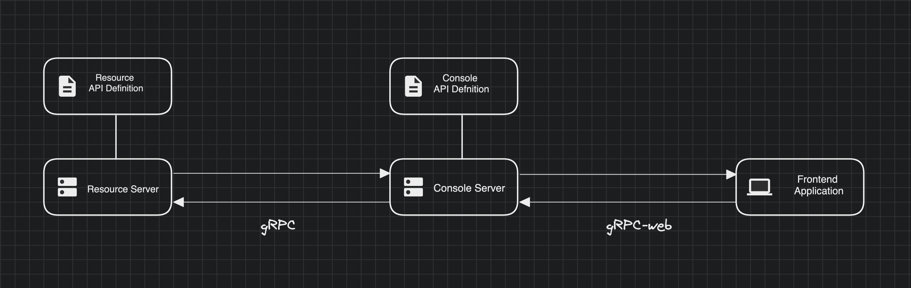
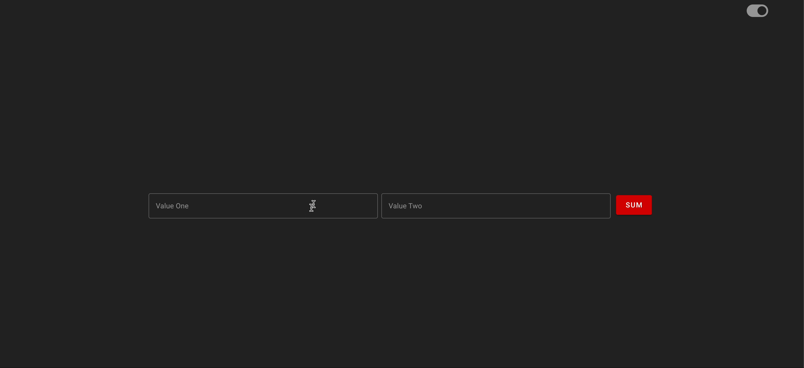

# Build your first console

This how-to-guide will take you through the steps of defining a resource service all the way through to consuming the service on a frontend application. 

## Prerequisites
To get started with this guide, there are a few things you need to have done as an Alis Builder:

1. Ensure you have installed and set up the [Alis CLI](../getting-started/command-line-interface.md)
2. Ensure you have [created a product on the Alis Build platform](../getting-started/conceptual-framework.md)
3. Ensure you have been added to the relevant organisation's developers group. Request to be added by the owner of the
organisation.

::: info 
You can list all available organisations and their owners by running `alis org list`
:::

# Conceptual Overview

A console in the Alis Build ecosystem is a web application which leverages a backend-for-frontend pattern to provide the
means to consume multiple products within one interface. Since consoles follow a resource oriented design principals, similar to 
a Alis Build product, it ensures end-to-end type safety with type definitions flowing through from the backend to the frontend.
The conceptual overview of the pattern is depicted in the image below.

<div>

</div>

A resource server is responsible for all resource management services. A console server is responsible for managing 
communication with all resources servers as well as hosting the frontend application. Communication between resource 
and console servers take place through gRPC and the console server and the frontend application utilises gRPC-web for communication.

## Resource Service

For our resource service we will define a service `CalcService` with a `ResourceMethodSumCalculation` method, which takes in a request `SumRequest` and returns 
a response `SumResponse`. The `SumRequest` will have two arguments of which the `ResourceMethodSumCalculation` will calculate the sum 
and return the answer in the `SumResponse`.

First we create a new proto through the Alis Build CLI. From your terminal, run the `alis proto create` 
command with your organisation and product's name. This guide uses the `play` organisation and the `me` product.

```bash
alis proto create alis.play.me.services-calculate-v1
```

This will create a new proto with a set of terraform files to specify the cloud infrastructure used to make the service available. The proto definition for our `ResourceMethodSumCalculation` with 
the corresponding `SumRequest` and `Sumresponse` are:

```protobuf
// Calculation service
service CalcService {
  // Calculate the sum of two numbers
  rpc ResourceMethodSumCalculation (SumRequest) returns (SumResponse) {
    option (google.api.http) = {
      post: "/services/calculate/v1:resourceMethodSumCalculation";
      body: "*";
    };
  }
}

// SumRequest definition
message SumRequest {
  // The first value to sum
  float value_one = 1;
  // The second value to sum
  float value_two = 2;
}

// SumResponse definition
message SumResponse {
  // Sum of the two values
  float sum = 1;
}

```
We release the newly defined resource service through the Alis Build CLI to generate the necessary protobufs required to
implement and consume the service. 

```bash
alis proto release alis.play.services-calculate-v1
```

Implementing the service requires a unit of compute, or know in Alis Build ecosystem as a neuron. To create a new neuron we run the following command in the terminal:

```bash
alis neuron create alis.play.services-calculate-v1
```

This creates a set of terraform files to implement according to the neuron's requirements.

With the protobufs published we can implement the method in the language of our choice. In this guide we implemented the methods in Go.

```go
package main

import (
	"context"
	pb "go.protobuf.playground.exchange/play/me/services/calculate/v1"
)

// Create a Service object which we'll register with the Server
type myService struct {
	pb.UnimplementedCalcServiceServer
}

// ResourceMethodSumCalculation method is the implementation of the ResourceMethodSumCalculation method in the CalcService service.
func (s *myService) ResourceMethodSumCalculation(ctx context.Context, req *pb.SumRequest) (*pb.SumResponse, error) {
	
	// Calculate the sum of the two argument values in the request
	sum := req.ValueOne + req.ValueTwo
    
	// Initialise the response with the calculated sum
	res := &pb.SumResponse{Sum: sum}

	return res, nil
}
```
The imported protobufs provide all the types defined in the proto for the request, response and methods. Most IDEs
allow you to explore these by hovering over the client and method names.

With the service implemented all that is left to do is to release and deploy the neuron through the Alis Build CLI. Run the following set of commands from your terminal:

```bash
alis neuron release alis.play.services-calculate-v1
```

When deploying the service a set of environmental variables are defined, which are used in the management of the 
underlying cloud infrastructure. In the neuron's `cloudrun.tf` file found in the organisations proto repo, 
specify a new `env` in the `containers` specifications.

```terraform
spec{
  containers{
    ...
    env {
      name = "ALIS_OS_HASH"
      value = var.ALIS_OS_HASH
    }
  }
}
```

Define the variable in the `variables.tf` file as follows:

```terraform
variable "ALIS_OS_HASH" {}
```

These variables are populated by the Alis Build platform when deploying the neuron. We are now ready to deploy the resource service.

```bash
alis neuron deploy alis.play.services-calculate-v1
```

::: info Setting the `ALIS_OS_HASH` environment variable
If this is the first time the neuron is deployed you will be promoted to create a new neuron deployment. 
Follow the steps outlined in the Alis Build CLI. When asked to create a new
ENV, add the `ALIS_OS_HASH` as a new variable with `TBC` as the value, for the purposes of completing this guide. You can 
re-deploy the neuron at a later stage through the CLI with the flag `-e` where you can reset the variable's value to the correct cloud run hash.
:::

The resource service is now ready to be consumed.

## Console Service

Designing and implementing a console service follows the same flow as designing and implementing a resource service. We 
create a new console proto for the `me` product in the `play` organisation with the following Alis Build CLI command:

```bash
alis proto create alis.play.services-console-v1
```

We define a service in the console proto called `CalculationService` with a `SumCalculation` method which takes a 
`SumRequest` and `SumResponse`. We define the `SumRequest`
and `SumResponse` to match the resource service's `SumRequest` and `SumResponse`. However, the purpose of a console 
service is to gather the data from all the resource services, either a single resource service or multiple and collate the 
data in the format the frontend requires. For this reason the console service is seen as the backend-for-frontend layer.
The request and response of the console service can therefore have a custom definition. The completed `SumCalculation` 
method definition would be:

```protobuf
// Calculation service
service CalculationService {
  // Calculate the sum of two numbers with the consumption 
  // of the CalcService resource service
  rpc SumCalculation (SumRequest) returns (SumResponse) {
    option (google.api.http) = {
      post: "/services/console/v1:sumCalculation";
      body: "*";
    };
  }
}

// SumRequest definition
message SumRequest {
  // The first value to sum
  float value_one = 1;
  // The second value to sum
  float value_two = 2;
}

// SumResponse definition
message SumResponse {
  // Sum of the two values
  float sum = 1;
}

```

Running the following command publishes the necessary protobufs required to implement the
service.

```bash 
alis proto release alis.play.me.services-console-v1
```

To implement the console service we require a console server, i.e a console neuron. As mentioned the console server is responsible 
for handling all communication to all resource servers as well as hosting the frontend application.

With the help of the Alis Build CLI a console neuron can be pre-populated with boilerplate Vue 3 code. 
The application is pre-installed with [Vite](https://vitejs.dev/), [Typescript](https://www.typescriptlang.org/), [Vuetify 3](https://next.vuetifyjs.com/en/),
[Pinia](https://pinia.vuejs.org/) (the official Vue  state management package) and [Vue Router](https://router.vuejs.org/). 
The boilerplate application code could be generated when a new neuron is created or with the `alis gen code` command with 
the `--console` flag for an existing neuron.

Create a new console neuron with: 

```bash
alis neuron create alis.play.services-console-v1
```

::: info Generate boilerplate application code with new neuron creation
When creating a new neuron, the Alis Build CLI will ask if boilerplate code should be generated. 
Type `y` if desired, followed by selecting the `console` option. 
For this guide we will use the `alis gen code` command with the `--console` flag in the following section.
:::

Consuming a resource service requires the console neuron to establish a new client connection to the resource server. 
This is done in the `conn.go` and the `cliets.go` file in the `console/v1/internal` folder. The completed `clients.go` file for the 
`Calculate` resource service client should look something like this.

```go

package clients

import (
	"context"
	pbPlay "go.protobuf.playground.exchange/play/me/services/calculate/v1"
	"log"
	"os"
)

var (
	Calculate pbPlay.CalculationServiceClient
)

func init() {

	// Ensure that required envs exist.
	if os.Getenv("ALIS_OS_PROJECT") == "" {
		log.Fatal("ALIS_OS_PROJECT env not set.")
	}
	if os.Getenv("ALIS_OS_HASH") == "" {
		log.Fatal("ALIS_OS_HASH env not set.")
	}

	// Instantiate a client
	if conn, err := NewConn(context.Background(),
		"services-calculate-v1-"+os.Getenv("ALIS_OS_HASH")+"-ew.a.run.app:443", false); err != nil {
		log.Fatal(err)
	} else {
		Calculate = pbPlay.NewCalculationServiceClient(conn)
	}
}
```
The `Calculate` resource service client is now available, allowing us to implement the `SumCalculation` console method. In the `methods.go` 
file create a method which makes a request to the `Calculate` resource service client's `ResourceMethodSumCalculation` method.

```go

package main

import (
	"context"
	pb "go.protobuf.playground.exchange/play/me/services/console/v1"
	"google.golang.org/grpc/codes"
	"google.golang.org/grpc/status"
	"play.me.services.console.v1/internal/clients"
)

// Create a Service object which we'll register with the Server
type myService struct {
	pb.UnimplementedCalculationServiceServer
}

// SumCalculation method is the implementation of the SumCalculation method in the CalculationService service.
func (s *myService) SumCalculation(ctx context.Context, req *pb.SumRequest) (*pb.SumResponse, error) {
	
	CalcServiceReq := &pbPlay.req{
		ValueOne: req.value_one,
		ValueTwo: req.value_two,
    }
    
	// Make a request to the CalService in the Calculate resource client
	sum, err := clients.Calculate.ResourceMethodSumCalculation(ctx, CalcServiceReq)
	if err != nil {
		return nil, status.Error(codes.Internal, "Error summing values: "+err.Error())
	}

	// Initialise the response with the calculated sum
	res := &pb.SumResponse{Sum: sum}

	return res, nil
}

```

The console service is now ready to consumed by the frontend application.

## Consuming services on the frontend

With both the resource service and the console service implemented, we are now ready to consume the console service 
in the frontend application. To add a boilerplate frontend application to your existing console neuron, run 
the following gen code command in your terminal:

```bash
alis gen code alis.play.me.services-console-v1 --console
```

Importing the protobufs for both the resource services and console services, the application must be authenticated to the
relevant organisation's artifact registry. This is achieved by adding a `.npmrc` file to the root folder of the
application and adding the following code snippet with the variables `ORG_DOMAIN` and `ORG_PROJECT` populated accordingly.

```js
@{ORG_DOMAIN}:registry=https://europe-west1-npm.pkg.dev/{ORG_PROJECT}/protobuf-javascript/europe-west1-npm.pkg.dev/{ORG_PROJECT}/protobuf-javascript/:always-auth=true
```

For this guide the resulting code snippet would be:

```js
@alis.services:registry=https://europe-west1-npm.pkg.dev/alis-org-777777/protobuf-javascript/europe-west1-npm.pkg.dev/alis-org-777777/protobuf-javascript/:always-auth=true
```

To locally authenticate the application to the organisation's artifact registry run the following `npm` command:

```bash
npm run auth_alis_local
```

After authentication and installing all required packages with `npm install`, start up a local server with `npm run dev`. 
You can view your new console in the browser at `localhost:8080`.

<div>

</div>

To consume a service from your frontend, a console service client is required. We define a global console service 
client in the `index.ts` file in the `app/src/stores` folder.

```js
import { ServicePromiseClient } from "@alis.services/protobuf/play/me/services/console/v1/console_grpc_web_pb";

const srv = new ServicePromiseClient(import.meta.env.VITE_Base_URL, null, null);

export default srv;
```

::: info Environmental variables in the frontend
The environment variable for the `VITE_Base_URL` is set in a _.env_ file in the root directory of your application. We have two environments in this guide, `dev` and `prod`. 
For more details on environment variables in Vite, read the official [Vite documentation](https://vitejs.dev/guide/env-and-mode.html).
The _.env_ files for the respective environments are:

_.env.development_

```
VITE_ENV=Dev
VITE_Base_URL=http://localhost:8000
```

_.env.production_

```
VITE_ENV=Dev
VITE_Base_URL=
```
:::

To consume the `CalculationService` service from the console service client we define a function which initialise a new
`SumRequest` and `SumResponse`, and makes a request to the `SumCalculation` method. Using the protobuf helper methods
we can initialise and set attributes for the defined message types.


```js
import {SumRequest, SumResponse} from "@playground.exchange/protobuf/play/me/services/console/v1/console_pb";

    async function sum(valueOne: number, valueTwo: number){
        let answer = new SumResponse()
        try {

            let req = new SumRequest()
            req.setValueOne(valueOne)
            req.setValueTwo(valueTwo)

            answer = await srv.sumCalculation(req)

        } catch (error: Error) {
            console.log(error);
        }

    }
```

Finally, a simple form component taking in two arguments and passing it to the `SumCalculation` method through the sum function.

```vue
<template>
  <v-container>
    <v-card height="800" flat>
      <v-card-text style="height: 100%"  class="d-flex justify-center align-center">
        <v-row>
          <v-col cols="12" sm="12" md="12" class="d-flex flex-row">
            <v-text-field class="mx-1" v-model="valueOne" label="Value One" variant="outlined"></v-text-field>
            <v-text-field class="mx-1" v-model="valueTwo" label="Value Two" variant="outlined"></v-text-field>
            <v-btn class="mx-2 mt-1" color="primary" size="large" @click="sum">Sum</v-btn>
          </v-col>
          <v-col cols="12" sm="12" md="12" v-if="Object.keys(answer).length > 0" class="d-flex flex-row justify-center">
            <v-card-title>
              Calculation Service Answer: {{ answer }}
            </v-card-title>
          </v-col>
        </v-row>
      </v-card-text>
    </v-card>
  </v-container>
</template>

<script setup lang="ts">
import {computed, Ref, ref} from "vue"
import {useSumStore} from "../stores/SumStore";

const SumStore = useSumStore()

const valueOne: Ref<string > = ref('')
const valueTwo: Ref<string> = ref('')

const answer = computed(() => {
  return SumStore.answer
})

function sum(){
  const numberOne = parseFloat(valueOne.value)
  const numberTwo = parseFloat(valueTwo.value)

  SumStore.sum(numberOne, numberTwo)
}

</script>
```

The resulting component can be seen below.

<div>

</div>

